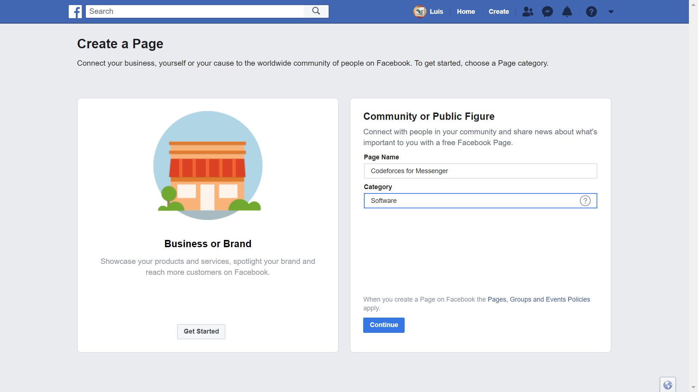
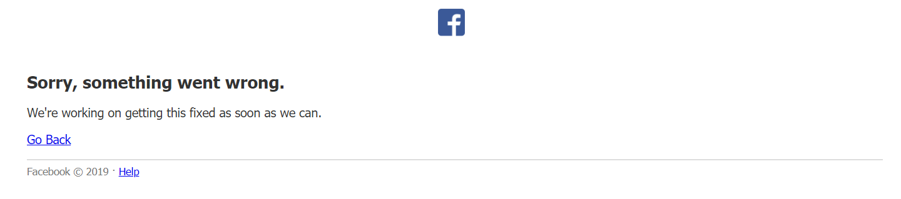
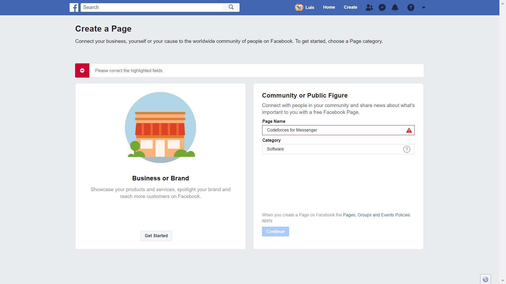
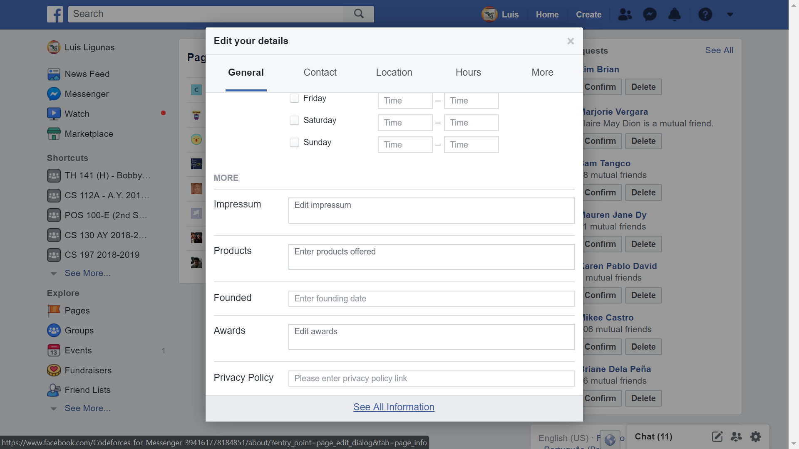
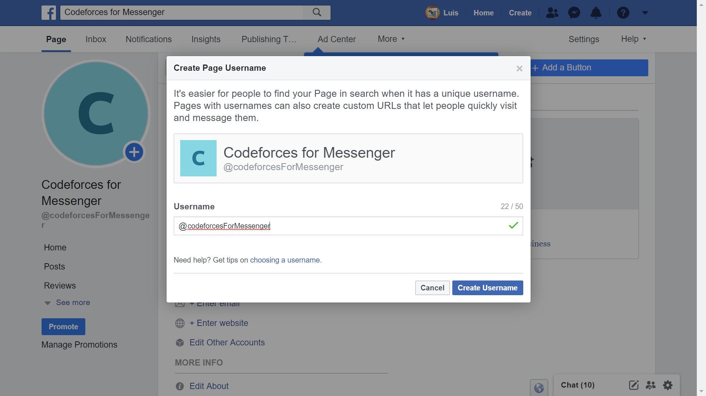
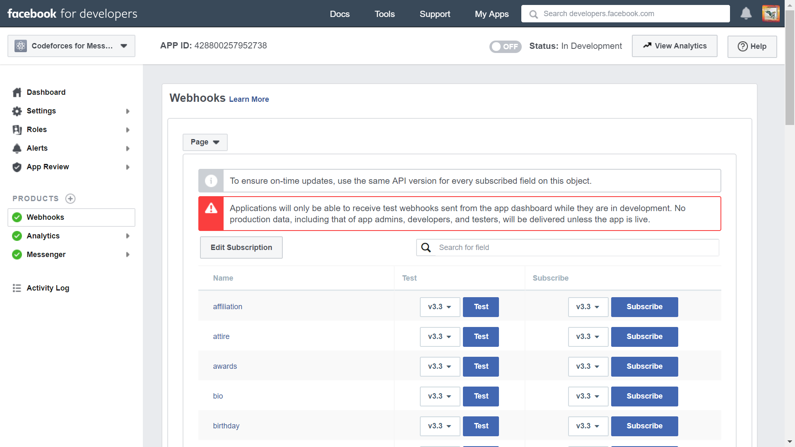

## Day 2
*12 June 2019*

For this day, I decided to start creating a Messenger chatbot for Codeforces. I haven't ironed out the details such as what features I want it to have, but I decided to just get into it to try to figure out how to make a basic chatbot on Messenger first.

Facebook for Developers already had an existing sample Messenger app so I followed the [instructions](https://developers.facebook.com/docs/messenger-platform/getting-started/sample-apps/original-coast-clothing) for deploying this app. These instructions were mostly straightforward; although, I will be noting here my process in case someone encounters similar difficulties while following Facebook for Developers' documentation.

Note that the steps which I indicate that do not have any additional details to them are simply subsections in the Facebook for Developers documentation which I directly followed.

### Steps
- Reset everything
    - I have tried to make this chatbot in the past, but I never really got through to continuing it. Given this, I already had a few things set up. So before doing anything else, I deleted the (1) Facebook page and the (2) Facebook app on Facebook for Developers that I previously created, just so I could start from a clean slate.
- [Create Page](https://www.facebook.com/pages/create)
    - I chose the **Community or Public Figure** option and filled it out as seen in the following image. 
    - When I pressed **Continue**, however, there was a prompt that an error occurred. 
    - When I tried to do it again, there was a prompt that I already had a page with the same name. 
    - I figured that the page was already created, so I went to [view my pages](https://www.facebook.com/bookmarks/pages) and, true enough, it was already there. When I clicked on the page, however, it brought me to a page saying that there was an error. So instead of clicking on the page name itself, I clicked on the gear (settings) button beside it. It opened a pop-up and I scrolled down the **General** tab and clicked **See All Information**. 
    - This successfully brought me to the page I just created. Not knowing if it was necessary or not, I also edited the page's username. 
- Create Facebook App
    - Since I already had a Facebook Developer Account, I went straight to creating a Facebook App and it was very straightforward.
    - I also collected the PAGE_ID, APP_ID, PAGE_ACCESS_TOKEN, and APP_SECRET as indicated in the documentation.
- Install [Node.js](https://nodejs.org/en/)
    - I downloaded the v. 10.16.0 LTS for Windows (x64), which was the recommended version at the time of writing this.
- Install [Yarn](https://yarnpkg.com/lang/en/docs/install/#windows-stable)
    - I downloaded version 1.16.0 for Windows, which was the stable version at the time of writing this.
- Clone sample Messenger app repository and install dependencies
    - There was no problem cloning the repository, but Yarn wasn't available from any directory yet, despite it already being in my PATH. To fix this, I just restarted my machine.
- Using ngrok instead of LocalTunnel
    - I encountered an issue when running `lt --port 3000` using LocalTunnel. I found out that a lot of people were having the same [issue](https://github.com/localtunnel/localtunnel/issues/258), which turns out to be a server-side problem.
    - Looking for alternatives to LocalTunnel, I found **ngrok** which was easy to use but did not have the *free* capability of setting a constant subdomain. It was, however, a bearable problem. I simply followed the [instructions](https://dashboard.ngrok.com/get-started) for set-up and installation and it worked perfectly.
    - So instead of running `lt --port 3000`, I ran `ngrok http 3000`. Note that ngrok must either be added to the PATH or added in the project directory.
- Setting up the .env file
- Testing that the app works
- Download [Heroku CLI](https://devcenter.heroku.com/articles/heroku-cli#download-and-install)
    - I downloaded the Heroku 64-bit installer for Windows.
    - I don't know why, but the link I provided would sometimes be unreachable through my Wi-Fi connection. It worked, however, when I connected to my mobile data.
- Deploying the app on Heroku
- Testing (again) that the app works
    - If it wasn't obvious, if your app is already running on Heroku there is no need to keep the terminals, in which you typed in the commands `ngrok http 3000` and `node app.js`, running.

Learning how to set up all of these was great, but it's simply a step towards my goal. I plan to start learning how to use the Node.js framework in the coming days. Basically, I want to know how to connect to Messenger with a Node.js project that I code from scratch.

---
## Days 3, 4, and 5
*22-24 June 2019*

After setting up the sample Messenger app in day 2, I wanted to create my own webhook from scratch. Not knowing how to do that, I first checked out Facebook for Developers' [tutorial](https://developers.facebook.com/docs/messenger-platform/getting-started/webhook-setup) on how to set up webhooks, which had step-by-step instructions. The problem for me, however, was that I didn't understand any of the code at all. So, I looked online for a beginner course on Node.js and I found [this video](https://www.youtube.com/watch?v=TlB_eWDSMt4) on YouTube. It had a lot of concepts that were standard programming or web development ideas, but I listed down some notes on topics that were new to me. I also watched [this video](https://www.youtube.com/watch?v=pKd0Rpw7O48), which was a sequel to the previous video and mainly tackled how to use Express, among other important topics in using Node.js.

### Notes
Node.js
-  a **runtime environment** for executing JavaScript code
    - **!!!** *neither a programming language nor a framework*
- open-source
- great for prototyping
- scalable, because of its speed
- asynchronous (non-blocking)
- ideal for I/O-intensive applications
- NOT ideal for CPU-intensive applications
- In JavaScript, all functions and variables defined globally can be accessed through `window`. The Node alternative of `window` is the keyword `global`. Functions and variables declared globally, however, cannot be accessed through the `global` keyword; only built-in functions (and variables?) may be accessed.
- Every file in a Node.js app is considered a module.
    - The following is the module wrapper function: `function(exports, require, module, __filename, __dirname)`
    - The expressions `module.exports` and `exports` only differ in the sense that you can change the value of the former, but not the latter; doing so with the latter only changes its value locally in the module.
    - It is ideal to declare modules as constants.

Some Useful Tools
- [JSHint](https://jshint.com/): detects errors and potential problems in JavaScript code
- [Express](https://expressjs.com/): framework for creating web apps and APIs using Node.js
- [Nodemon](https://nodemon.io/): allows automatic restarting of Node.js application when a file has been edited
- [Joi](https://www.npmjs.com/package/@hapi/joi): validates JavaScript objects

Some Useful Commands
- `npm init --yes`: makes a package.json file
- `npm install -g <package_name>`: installs a package globally
- `set <key>=<value>` (Windows) or `export <key>=<value>` (Mac): defines `process.env` key-value pairs

Some Code Snippets
- Setting server ports and accessing environment variables
```JavaScript
const port = process.env.PORT || 3000;
const express = require('express');
const app = express();
app.listen(port, () => {
    console.log(`Listening on port ${port}...`);
});
```
- Allowing direct reading of response bodies as JSON (I think)
```JavaScript
app.use(express.json());
```
- Using Joi for object validation
```JavaScript
const Joi = require('joi'); //Note: outdated version
function validateObj(obj) {
    const schema = {
        name: Joi.string().min(3).required()
    };
    const { error } = Joi.validate(obj, schema);
    if(error) return res.status(400).send(error.details[0].message);
    else { //validated }
}
```
- Responding to a GET request and how to access values in the request
```JavaScript
app.get('/api/courses/:course_id', (req, res) => {
    res.send(`Course ID is: ${req.params.course_id}.`);
    //Access request body through: req.body
    //Access query parameters through: req.query
});
```
- Using EventEmitter
```JavaScript
const EventEmitter = require('events');
const emitter = new EventEmitter();
emitter.on('trigger', (arg) => {
    //Action when emitter.emit('trigger', ...) is called
});
emitter.emit('trigger', <some arguments>);
```
- Exporting values in modules
```JavaScript
//require-ing this module would return a list of key-value pairs
module.exports.key = value;
//require-ing this module would return the value itself
module.exports = value;
```
Looking back at the sample code that Facebook for Developers provided for setting up webhooks, I believe that the two videos I watched and studied were able to equip me with all the concepts, regarding Node.js, its libraries/frameworks, JavaScript, and ES6, that I need to understand to modify the sample code for my own purposes.

---
## Days 6, 7, and 8
*25-27 June 2019*

Looking at Facebook for Developers' [tutorial](https://developers.facebook.com/docs/messenger-platform/getting-started/webhook-setup), I already had some idea one how to modify it for my purposes. I simply copy-pasted it and deployed it to a Heroku app.

Before anything else, however, I needed to subscribe my webhook to my Facebook app. Facebook for Developers also had a [tutorial](https://developers.facebook.com/docs/messenger-platform/getting-started/app-setup) on how to do this. The instructions for the second step, however, seems to be outdated as I couldn't find the *Setup Webhooks* button that the documentation was referring to. I found the *Edit Subscription* button which open a dialog with the fields that I needed to edit. I used the `/webhook` endpoint of my Heroku app for the callback URL. Note that the verify token should be the same as in the webhook verification part seen in the first tutorial. 

Now that this was setup, Heroku showed the webhook logs whenever I sent a message through the Facebook App's chat. Because deploying to Heroku each time I made an edit to the code would take a lot of time, I used ngrok and edited the callback URL to the subdomain that ngrok generated. I wasn't 100% sure that this would work at the time, but everything worked out. I also used nodemon to remove the process of manually restarting the server.

I added my page access token and verify token in a newly created .env file, but I didn't know how to access those values. I looked at the [sample Messenger app](https://developers.facebook.com/docs/messenger-platform/getting-started/sample-apps/original-coast-clothing) that I deployed previously to see how to do it and it led me to a config.js file. This file used the [dotenv](https://www.npmjs.com/package/dotenv) package and exposed the environment variables through `module.exports`. I found this to be a clean way to access the environment variables, so I created my own config.js file that was structured in the same way.

My first goal was to learn how to send messages. I found Messenger's [Send API](https://developers.facebook.com/docs/messenger-platform/reference/send-api) and found out that it only required a simple POST request that contained the page access token. I created a simple module for sending messages called messenger-send.js. I implemented two functions: the first one simply sends a text message to a specified recipient and the second one does the same thing, but also offers [quick replies](https://developers.facebook.com/docs/messenger-platform/send-messages/quick-replies/) to the recipient. I used the [request](https://www.npmjs.com/package/request) package to send the POST requests. I also used the [Joi](https://www.npmjs.com/package/@hapi/joi) package to verify the structure of the arguments I passed into the functions.

I then looked at the [Codeforces API documentation](https://codeforces.com/api/help) to check out what information was available. I learned that most of the endpoints did not need an API key. Since I decided that I wanted the Messenger app to remind users of incoming Codeforces contests, I deemed that the `/contest.list` endpoint was the only one I needed. I was a bit concerned that the API didn't allow filtering and returned all contests, including those that were already completed. I'm not sure if this will make the app run slow, but I have yet to find out if this is the case. I didn't create a structured module yet, but I simply logged the details of the contests which were not yet finished to the console. This can be found in codeforces.js.

One of the next steps to complete the app would be to figure out how to structure the codeforces.js module as it would require multiple API calls. I think that it would just require a callback function, but I haven't fully thought it out in my head. Another step would be finding some sort of cron job for Heroku, as this is where I will keep the server running. I found that Heroku has a [Scheduler](https://devcenter.heroku.com/articles/scheduler), but I may need a [custom clock process](https://devcenter.heroku.com/articles/scheduled-jobs-custom-clock-processes) instead. I also need to learn how to connect my app to a database. A temporary solution could be using a Google Spreadsheet using the [Sheets API](https://developers.google.com/sheets/api/), but I would rather not resort to this.
